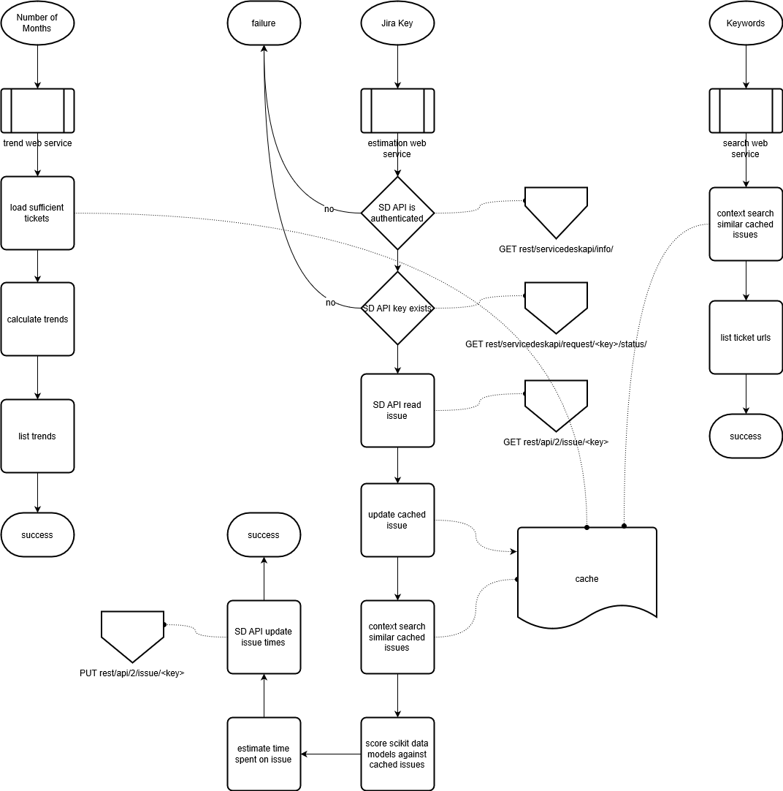

# Petrus 2
###### Pre Estimating Ticket Rates Using SciKit-Learn v2

Self-sufficient Python 3 web service package using SciKit-Learn to estimate times to process and finish a ticket, calculate trends and communicates with the Jira Service Desk API.

This application is running on Conda environments, provided by the Anaconda Machine Learning Framework.

https://docs.atlassian.com/jira-servicedesk/REST/3.6.2/

___

___

pip list -l
<pre>
Package         Version
--------------- -----------
certifi         2019.6.16
cycler          0.10.0
httplib2        0.13.1
joblib          0.13.2
kiwisolver      1.1.0
matplotlib      3.1.1
numpy           1.17.0
oauth2          1.9.0.post1
pandas          0.25.0
pip             19.2.2
pyparsing       2.4.2
python-dateutil 2.8.0
pytz            2019.2
PyYAML          5.1.2
scikit-learn    0.21.3
scipy           1.3.1
setuptools      41.1.0
six             1.12.0
sklearn         0.0
tlslite         0.4.9
Werkzeug        0.15.5
wheel           0.33.4
wincertstore    0.2
</pre>

Inspect Code:
SciKitLearn.py
Expected type 'int', got 'DataFrame' instead

___

Disclaimer: In order to reuse parts of this repository, please contact me directly on GitHub. For reasons of security you can not run this application unless you possess certain environmental and temporary folders, files and API secrets, which will not be provided in this repository.